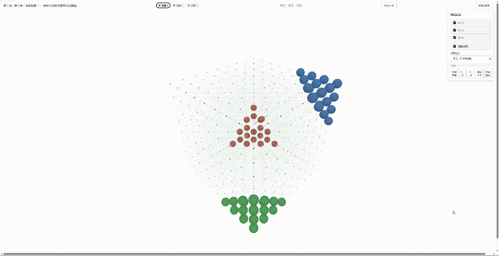
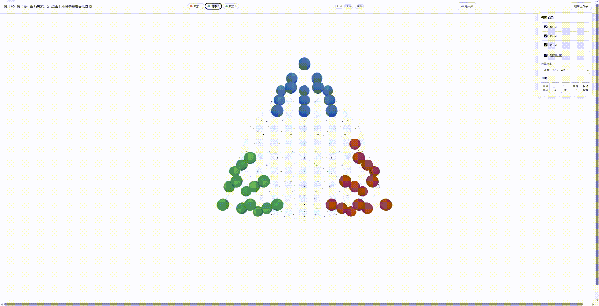
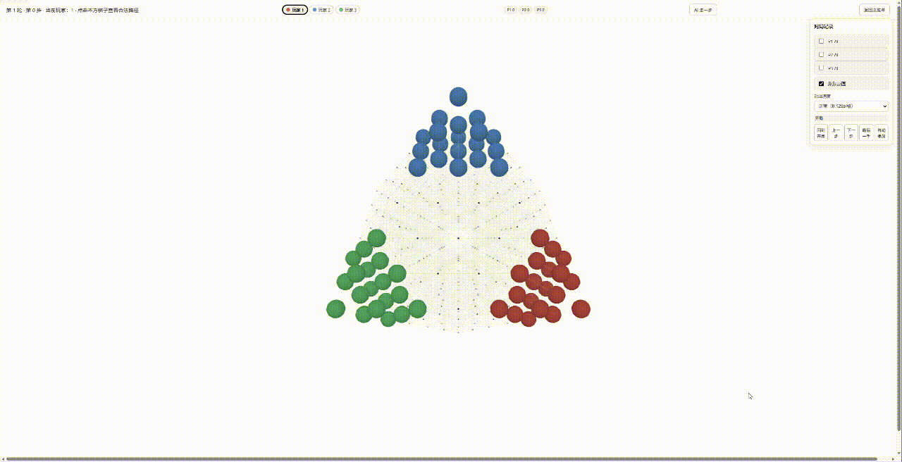
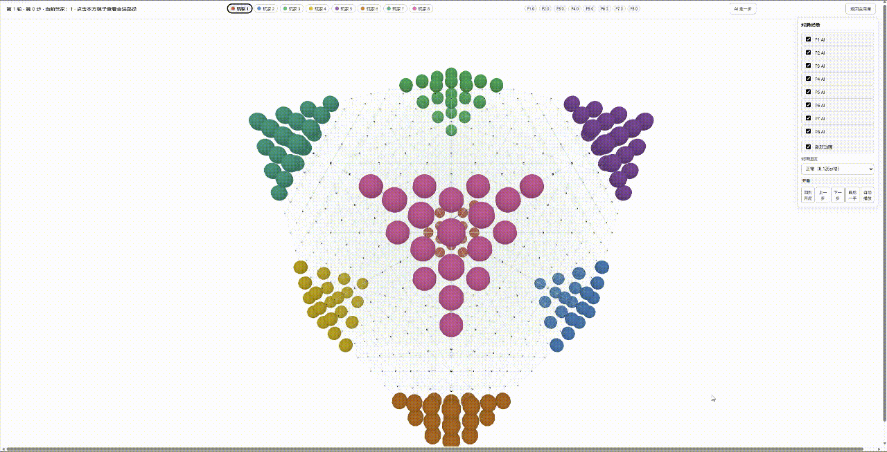

# PolyJump

[](LICENSE)
[](https://www.python.org/)

A configurable 3D jump-chess framework.

It includes multiple geometry models, rule configuration, a Three.js frontend, a `GameEnv` interface for external programs, and an AI benchmark directory.

## Online Demo

👉 [PolyJump Online Demo](https://sanzineo.github.io/polyjump/index.html)

## Demo

### Geometry Models

Model A · 3 players



Model B · 3 players



Model C · 3 players



### Multiplayer

Model A · 8 players



## Experiment Record

Small-sample data for the same MCTS search algorithm on A / B / C / D geometry models:

- **A / D**: lower average path
- **B / C**: higher average detour

See [docs/11-cross-geometry-discovery.md](./docs/11-cross-geometry-discovery.md) for the full data.

## Features

| Area | Content |
|---|---|
| Geometry models | A / B / C / D + A-ext / B-ext / C-ext, 7 total |
| Directions | 6 / 8 / 12 / 14 / 18 / 20 / 26, auto-matched or custom |
| Players | 2 / 3 / 4 / 6 / 8 |
| Movement | single move, jump, chain jump, two-hop, free stop, forced all |
| Game modes | Chinese checkers, Draughts (capture), Mixed |
| Scoring | chain jump, capture, target zone, win bonus — configurable |
| Frontend | HTML + Three.js, 3D rendering, legal-path highlight, AI autoplay, replay, i18n |
| Backend | Python + FastAPI, HTTP API and headless GameEnv |
| AI research | `ai_research/` benchmark with batch matches, metrics, timestamped archives |

## Requirements

- Python 3.11+
- Install dependencies: `pip install -r requirements.txt`
- Frontend has no separate build; it is served by the backend

## Quick Start

### Install dependencies

```powershell
pip install -r requirements.txt
```

### Launch the game

```powershell
python run.py
```

Starts the backend and opens the browser.

### Run headless

```powershell
python -m backend.game.headless --config configs/a_2p_6dir.json --actions 10
```

### Run AI benchmark

From the project root, using the project virtual environment:

```powershell
.poly_jump\Scripts\python.exe -m ai_research.runner --games 10 --radius 6
```

By default this evaluates 5 agents: `random` / `manhattan` / `euclidean` / `chebyshev` / `graph_bfs` (add `mcts` via `--agents`). Results are written to `ai_research/runs/<timestamp>/`.

**Local AI PK result** (A 9³ / B R=8, 80 games per config): `euclidean` is strongest, followed by `graph_bfs`, then `chebyshev` / `manhattan` / `random`. Full data in [docs/14-local-ai-pk.md](./docs/14-local-ai-pk.md).

## AI / Research Interface

External programs can drive the game through the Python interface:

```python
from backend.game.config import PolyJumpConfig
from backend.game.env import GameEnv

config = PolyJumpConfig(geometry="B", b_radius=6, players=2)
env = GameEnv(config)
obs = env.reset()

while not obs.done:
    actions = obs.legal_actions
    # Plug in your own agent here: MCTS / RL / LLM agent, etc.
    action = actions[0]
    obs = env.execute_action(action)
```

The `ai_research/` directory provides a frontend-free batch benchmark:

- Random/distance baselines + MCTS search baseline
- PettingZoo AEC wrapper (full_action / primitive)
- Full per-game records
- Win rate, average actions, target-zone metrics
- JSON / CSV / Markdown summaries

## Project Structure

```text
backend/
  app.py                 # FastAPI entry
  game/
    config.py            # Configuration
    geometry/            # Geometry models
    movement/            # Action generation / validation
    rules/               # Rule application / capture / winner
    env.py               # GameEnv interface
    scoring.py           # Scoring
    headless.py          # Pure-backend runner
frontend/                # HTML + Three.js frontend
ai_research/             # AI benchmark
  agents/                # Baseline agents
  runner.py              # Batch benchmark entry
  metrics.py             # Metric aggregation
  pk_analyze.py          # Offline PK tie-break / ranking
configs/                 # Example configs
docs/                    # Design documentation
tests/                   # pytest tests
tools/                   # Development probe scripts
```

## Documentation

| Document | Content |
|---|---|
| [Overview](docs/01-overview.md) | Project positioning and structure |
| [Geometry Models](docs/02-geometry-models.md) | 7 geometry models |
| [Game Rules](docs/03-game-rules.md) | Rules |
| [Configuration](docs/04-configuration.md) | Config reference |
| [Interfaces](docs/05-interfaces.md) | HTTP / GameEnv / headless interfaces |
| [Frontend](docs/06-frontend.md) | Frontend features |
| [AI / Research](docs/07-ai-and-research.md) | AI and research interface |
| [References](docs/08-references.md) | References |
| [Path Metrics](docs/09-path-metrics.md) | Action / Step data model |
| [Semantics](docs/10-semantics.md) | Rules / scoring / replay semantics |
| [Cross-Geometry Finding](docs/11-cross-geometry-discovery.md) | Preliminary cross-geometry path finding |
| [Supplementary Experiments](docs/12-supplementary-experiments.md) | Supplementary experiments (optional) |
| [LLM Agent Benchmark Design](docs/13-llm-agent-benchmark.md) | LLM match test design (draft, not implemented) |
| [Local AI PK](docs/14-local-ai-pk.md) | Local AI PK design and results |

## Current Status

- Game frontend, backend API, and 7 geometry models are implemented
- AI benchmark includes random / 4 distance baselines / MCTS search
- Local AI PK completed: `euclidean` > `graph_bfs` > `chebyshev` > `manhattan` > `random` (MCTS not tested)
- Possible extensions: RL / self-play, LLM agent integration (design in [docs/13](docs/13-llm-agent-benchmark.md))

## License

See [LICENSE](./LICENSE).
