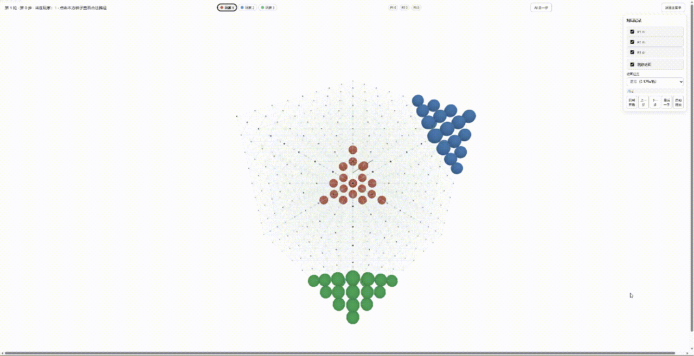
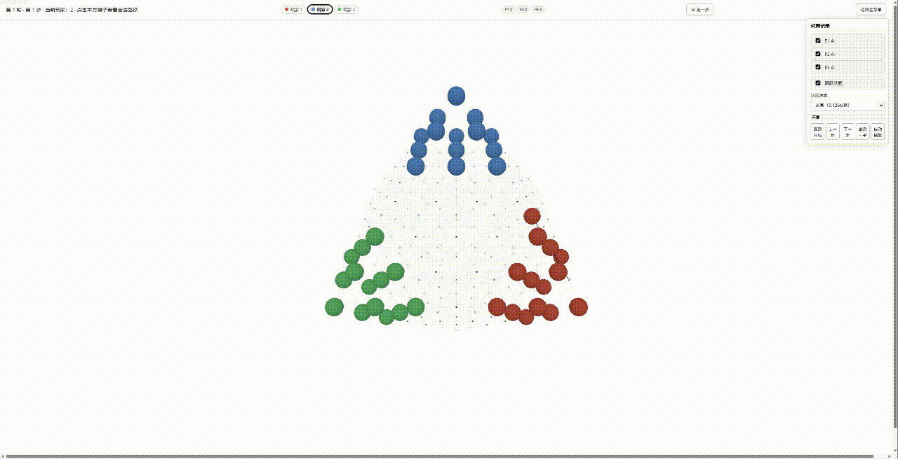
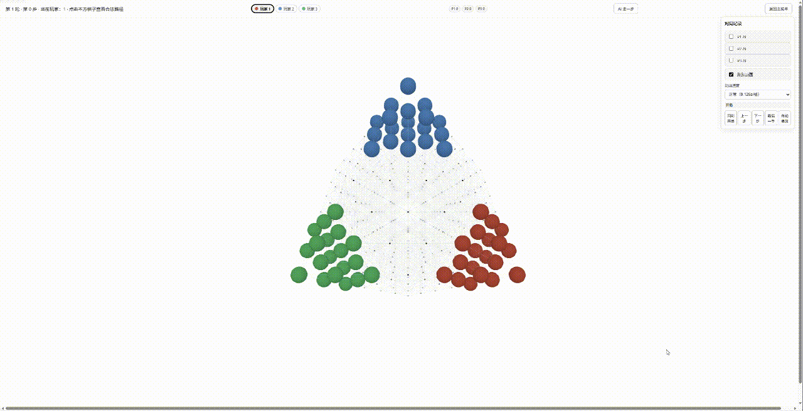
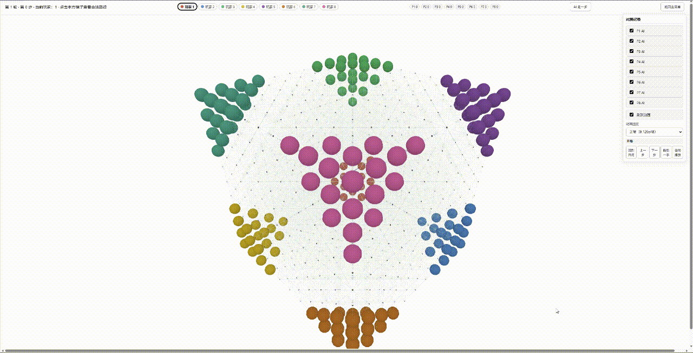

# PolyJump

[](LICENSE)
[](https://www.python.org/)

可配置的 3D 跳棋框架。

包含多种几何模型、规则配置、Three.js 前端界面，以及供外部程序使用的 `GameEnv` 接口和 AI 基准评测目录。

## 在线体验

👉 [PolyJump 在线 Demo](https://sanzineo.github.io/polyjump/index.html)

## 演示

### 几何模型

A 模型 · 3 人局



B 模型 · 3 人局



C 模型 · 3 人局



### 多人对局

A 模型 · 8 人局



## 功能

| 类别 | 内容 |
|---|---|
| 几何模型 | A / B / C / D + A-ext / B-ext / C-ext，共 7 种 |
| 移动方向 | 6 / 8 / 12 / 14 / 18 / 20 / 26，根据模型自动匹配或自定义 |
| 玩家数 | 2 / 3 / 4 / 6 / 8 |
| 移动规则 | 普通移动、跳跃、连跳、两格跳、自由停、强制跳到底 |
| 游戏模式 | 中国跳棋、西洋跳棋（吃子）、混合模式 |
| 积分 | 连跳、吃子、进目标区、胜利奖励，可配置开关 |
| 前端 | HTML + Three.js，3D 渲染、合法路径高亮、AI 自动对弈、回放、中英文切换 |
| 后端 | Python + FastAPI，HTTP API 和纯后端 GameEnv |
| AI 研究 | `ai_research/` 基准评测，支持批量对局、指标统计、时间戳归档 |

## 环境要求

- Python 3.11+
- 依赖安装：`pip install -r requirements.txt`
- 前端无独立构建，由后端静态托管

## 快速开始

### 安装依赖

```powershell
pip install -r requirements.txt
```

### 一键启动游戏

```powershell
python run.py
```

启动后端并打开浏览器。

### 纯后端运行

```powershell
python -m backend.game.headless --config configs/a_2p_6dir.json --moves 10
```

### AI 基准评测

在项目根目录，使用项目虚拟环境：

```powershell
.poly_jump\Scripts\python.exe -m ai_research.runner --games 10 --radius 6
```

默认评测 5 个 AI：`random` / `manhattan` / `euclidean` / `chebyshev` / `graph_bfs`，结果生成到 `ai_research/runs/<时间戳>/`。

## AI / 研究接口

外部程序可以通过 Python 接口驱动游戏：

```python
from backend.game.config import PolyJumpConfig
from backend.game.env import GameEnv

config = PolyJumpConfig(geometry="B", b_radius=6, players=2)
env = GameEnv(config)
obs = env.reset()

while not obs.done:
    actions = obs.legal_actions
    # 这里接入你的 AI：MCTS / RL / LLM Agent 等
    action = actions[0]
    obs = env.step(action)
```

`ai_research/` 提供不依赖前端的批量评测：

- 5 个随机/距离基线
- 每局完整记录
- 胜率、平均步数、目标区进出指标
- JSON / CSV / Markdown 汇总输出

## 目录结构

```text
backend/
  app.py                 # FastAPI 入口
  game/
    config.py            # 配置类
    geometry/            # 几何模型
    moves/               # 移动生成 / 校验
    rules/               # 规则执行 / 吃子 / 胜负
    env.py               # GameEnv 接口
    scoring.py           # 积分制
    headless.py          # 纯后端运行入口
frontend/                # HTML + Three.js 前端
ai_research/             # AI 基准评测
  agents/                # 基准 AI
  runner.py              # 批量评测入口
  metrics.py             # 指标统计
configs/                 # 配置示例
docs/                    # 设计文档
tests/                   # pytest 测试
```

## 文档

| 文档 | 内容 |
|---|---|
| [项目概览](docs/01-overview.md) | 项目定位和结构 |
| [几何模型](docs/02-geometry-models.md) | 7 种几何模型 |
| [游戏规则](docs/03-game-rules.md) | 规则说明 |
| [配置](docs/04-configuration.md) | 配置项 |
| [接口](docs/05-interfaces.md) | HTTP / GameEnv / headless 接口 |
| [前端](docs/06-frontend.md) | 前端功能 |
| [AI / 研究](docs/07-ai-and-research.md) | AI 和研究接口 |
| [参考资料](docs/08-references.md) | 参考 |

## 当前状态

- 游戏前端、后端接口和 7 种几何模型已实现
- AI 基准评测当前包含随机和 4 种距离基线
- 后续可扩展：MCTS / UCT、强化学习 / 自博弈、LLM Agent 接入

## License

See [LICENSE](./LICENSE).
